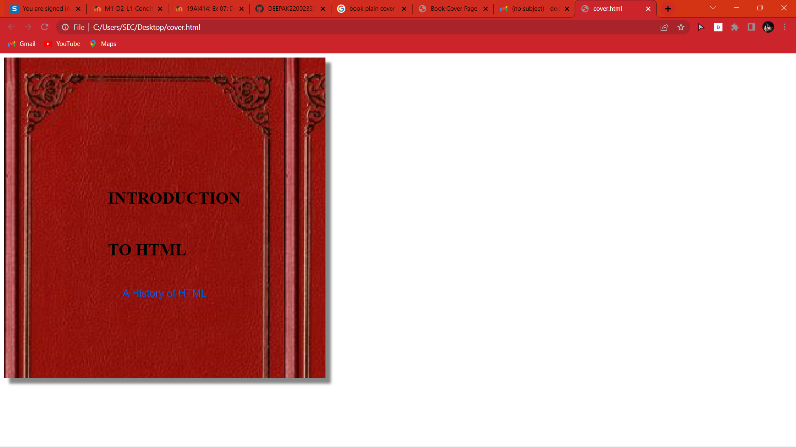

# Ex-06-Book-Cover-Design
## AIM:
To develop a website to display the cover page design of a book
## Design Steps:
Step 1:
Write the html code.
## CODE
```
<html>
<head>
<style>
#book-cover {
width: 220px;
height: 220px;
position: relative;
background-color: #f1f1f1;
background-image: url("qwerty.webp");
border-radius: 1px;
padding: 200px;
box-shadow: 10px 10px 5px #888888;
}
#book-cover h1 {
font-family: 'Times New Roman', Times, serif;
align:left;
font-size: 50px;
color: black;
line-height: 100px;
}
#book-cover p {
font-family: 'Arial', sans-serif;
font-size: 20px;
text-align: center;
color: #0055cc;
line-height: 25px;
}
</style>
</head>
<body>
<div id="book-cover">
<h1>INTRODUCTION TO HTML</h1>
<p>A Brief History of HTML</p>
</div>
</body>
</html>
```
## RESULT 

## OUTPUT
program is executed